# Happy House Project

## 1. 프로젝트 진행 방식

- 기존의 Back-End Happy House 프로젝트를 Spring으로 이전한다.
- MyBatis framework를 통해 코드와 SQL을 분리한다.
 
  
## 2. 요구사항 분석
- 요구사항을 분석하여 팀 프로젝트 방향과 알맞게 요구사항을 수정 및 반영한다. 
  
| 분류 | 요구사항 | 요구사항 상세 |
| ------ | ------ | ------ |
| 실거래가 	| 주택 실거래가 검색 | - 지역을 선택해 주택 실거래가 데이터를 제공한다.|
|   		| 실거래가 상세 정보	| - 검색 결과에서 관심 있는 주택의 상세 정보 조회가 가능하다. |
| 게시판 		| 글 쓰기 		| - 회원은 게시글을 작성할 수 있다.
|   		| 글 수정 		| - 자신이 작성한 글은 수정, 삭제가 가능하다. |
|   		| 답글 			| - 글을 클릭해 답글을 작성해 의견을 나눌 수 있다.|
| 회원 		| 회원 관리 		| - 유저는 언제나 회원 가입, 탈퇴, 수정을 할 수 있다. |
|  			| 로그인 관리 	| - 로그인, 로그아웃이 가능하다.|
| 시스템		| 인터셉터 		| - 인터셉터는 사용자의 로그인 여부를 체크하고 권한을 부여한다.  |
 

## 3. 구현 화면

[3.0 메인 페이지](#3.0-메인-페이지)

[3.1 실거래가 조회 페이지](#3.1-주택-실거래가-조회-관련)

[3.2 공지사항 페이지](#3.2-게시글,-공지사항-관련)

[3.3 회원 페이지](#3.3-회원-관련)

 

### 3.0 메인 페이지

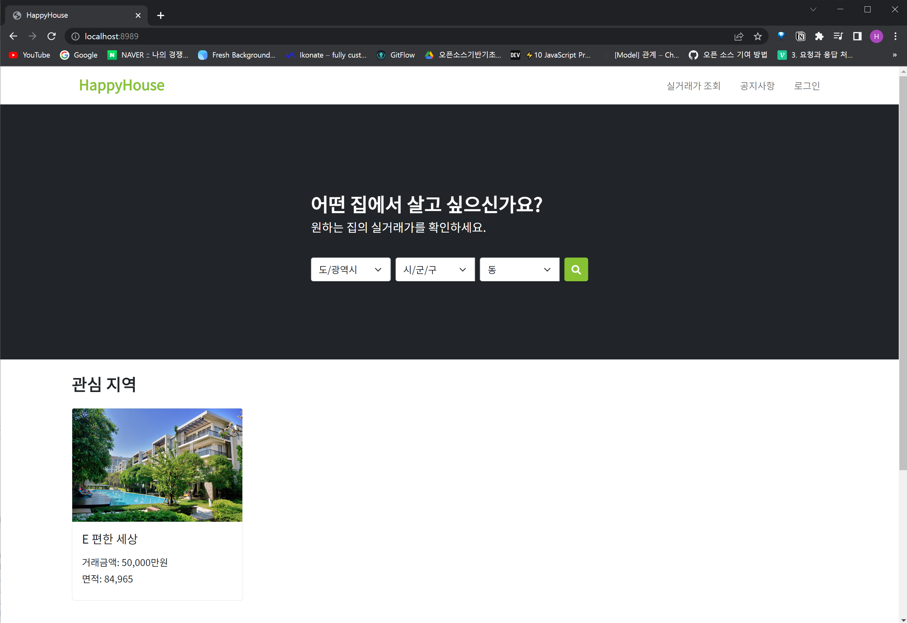

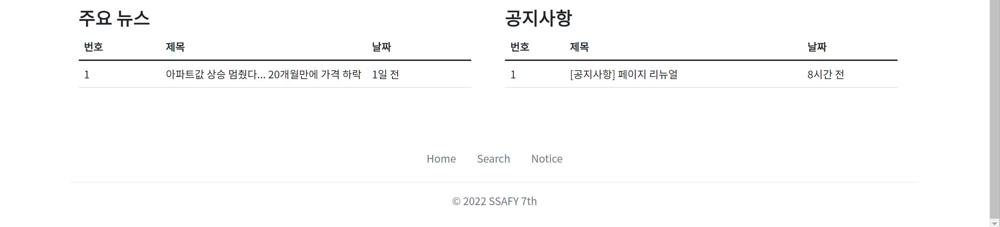

 

 

### 3.1 주택 실거래가 조회 관련

[3.1.1 메인 페이지에서 검색](#3.1.1-메인-페이지에서-검색)

[3.1.2 실거래가 조회 페이지에서 검색](#3.1.2-실거래가-조회-페이지에서-검색)

[3.1.3 주택 거래 내역 상세 정보 조회](#3.1.3-주택-거래-내역-상세-정보-조회)

 

#### 3.1.1 메인 페이지에서 검색

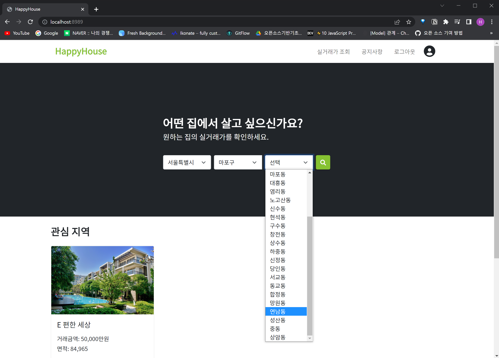

메인 페이지에서 검색할 지역을 선택한 후, 검색 버튼을 누르면

`/search` 페이지로 넘어가서, 지도에 해당 동의 위치를 찍어줌과 동시에 좌측에 거래 내역 정보들을 출력

-> 동기 방식으로 구현

 

#### 3.1.2 실거래가 조회 페이지에서 검색

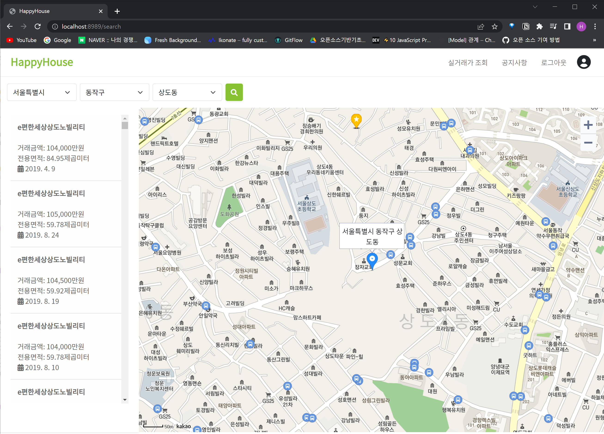

-> 비동기 방식으로 구현

 

#### 3.1.3 주택 거래 내역 상세 정보 조회

 

 

### 3.2 게시글, 공지사항 관련

[3.2.1 게시글 작성 및 조회](#3.2.1-게시글(원글)-작성-및-조회)

[3.2.2 답글 작성](#3.2.2-답글-작성)

[3.2.3 게시글 수정](#3.2.3-게시글-수정)

[3.2.4 게시글 삭제](#3.2.4-게시글-삭제)

 

#### 3.2.1 게시글(원글) 작성 및 조회

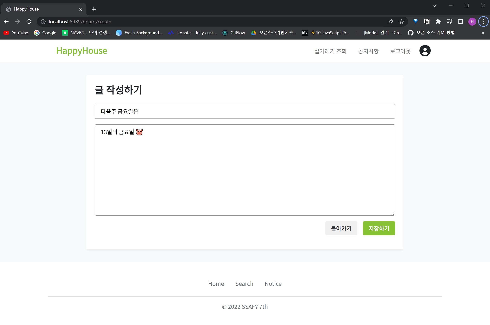

게시글 작성자가 현재 로그인한 사용자인 경우, 우측 상단에 게시글 수정/삭제 페이지로 이동할 수 있는 버튼 생성됨

게시글 리스트를 통해 잘 추가되었음을 확인

 

#### 3.2.2 답글 작성

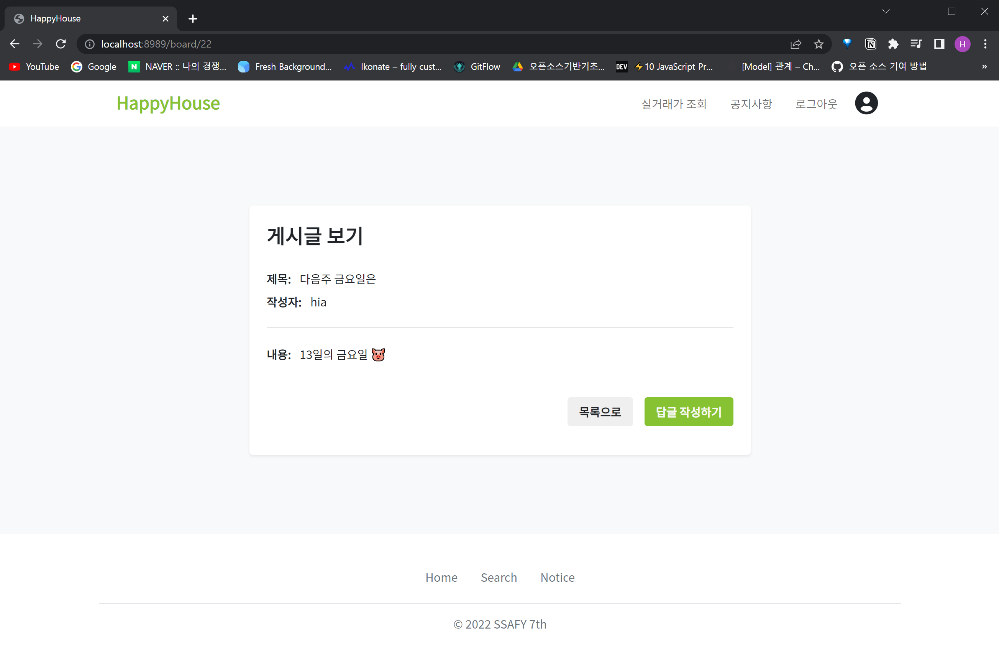

게시글 작성자와 현재 로그인한 사용자가 다른 경우, 우측 상단에 수정/삭제 페이지로 이동할 수 있는 버튼 없음

답글 작성하기 버튼을 통해 답글 작성 페이지로 넘어갈 수 있음

답글 작성 후, 게시글 리스트 (공지사항 메인 페이지) 페이지로 이동하면, `RE:` 로 답글이 생성되었음을 확인

 

#### 3.2.3 게시글 수정

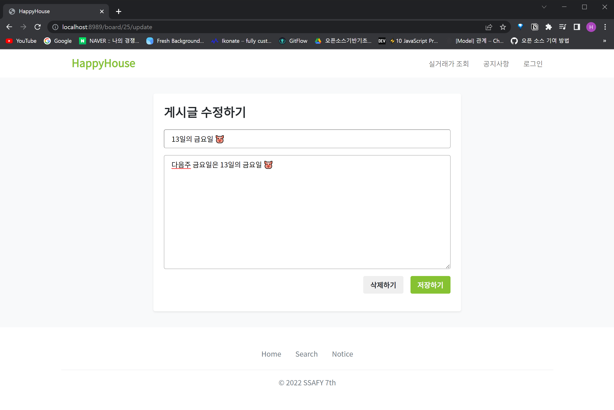

글 수정 성공 시, 글 조회 페이지로 이동과 동시에 수정 성공했다는 알림이 뜸

 

#### 3.2.4 게시글 삭제

 

 

### 3.3 회원 관련

[3.3.1 회원 가입 성공](#3.3.1-회원-가입-성공)

[3.3.1 회원 가입 실패: 중복 아이디 체크](#3.3.2-회원-가입-실패:-중복-아이디-체크)

[3.3.3 로그인](#3.3.3-로그인)

[3.3.4 로그아웃](#3.3.4-로그아웃)

[3.3.5 회원 정보 수정](#3.3.1-회원-정보-수정)

[3.3.6 회원 탈퇴](#3.3.1-회원-탈퇴)

 

#### 3.3.1 회원 가입 성공

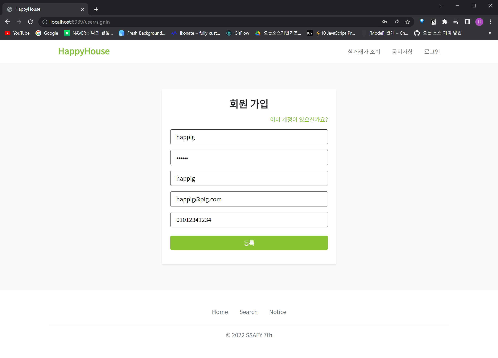

 

#### 3.3.2 회원 가입 실패: 중복 아이디 체크

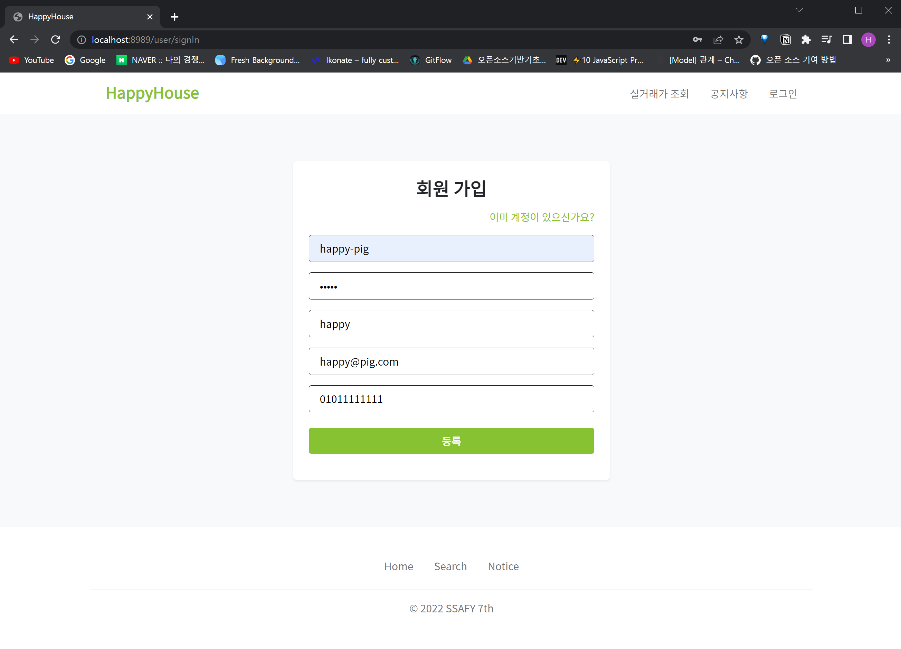

 

#### 3.3.3 로그인

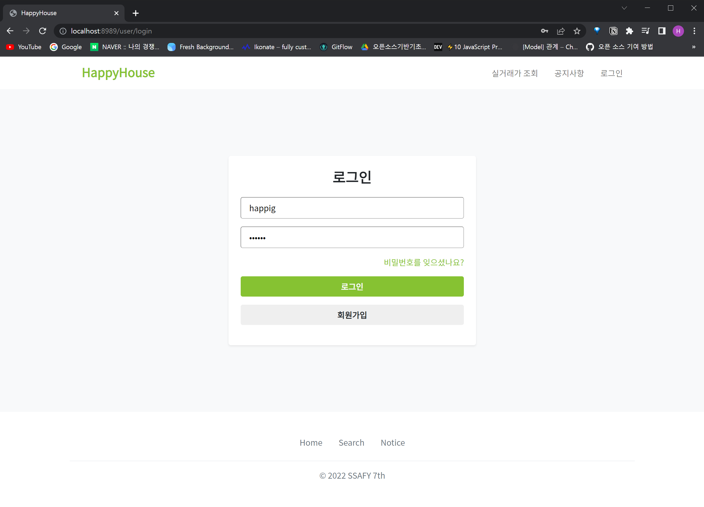

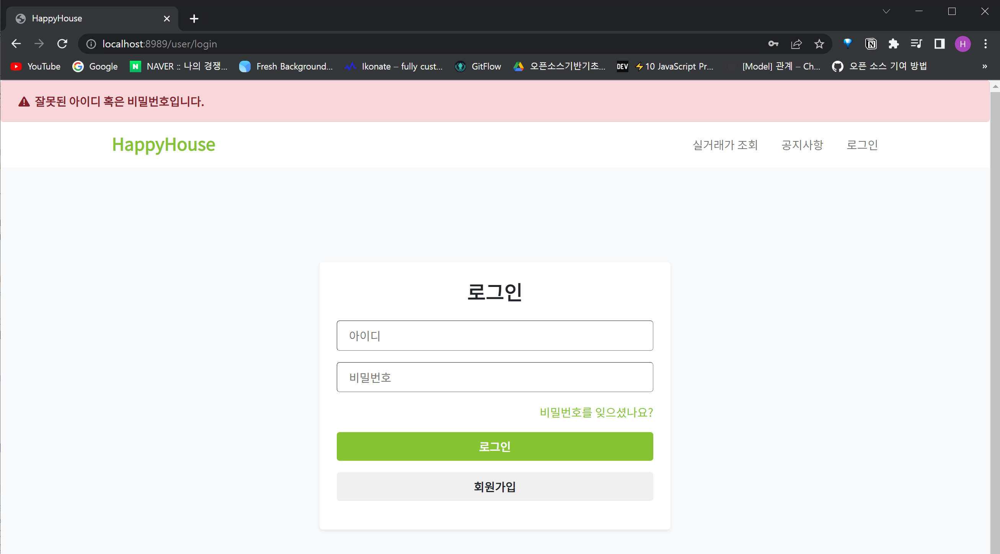

-> 로그인 실패: 잘못된 아이디 혹은 비밀번호

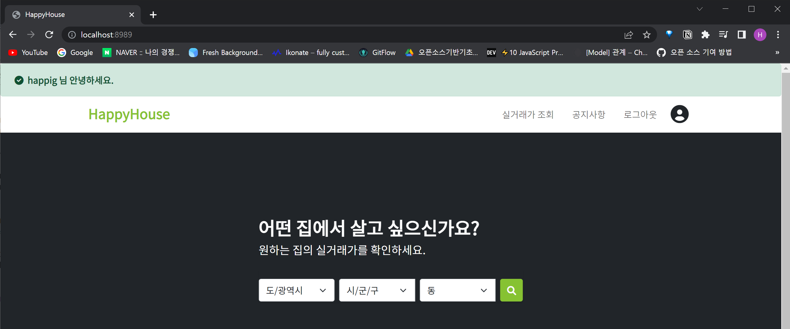

-> 로그인 성공

 

#### 3.3.4 로그아웃

 

#### 3.3.5 회원 정보 수정

-> 마이 페이지에서 회원 정보 수정 및 탈퇴 가능

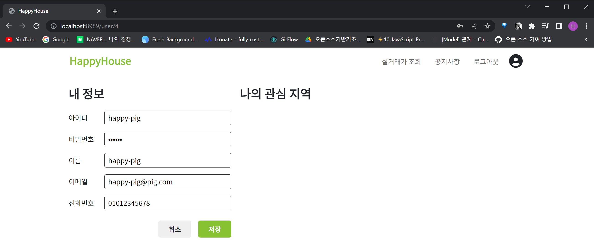

수정 버튼을 눌러, readonly 속성이었던 input 태그들을 활성화

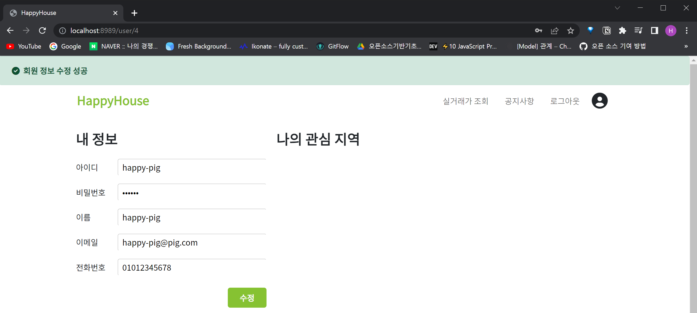

(비동기) 회원 정보 수정 성공

 

#### 3.3.6 회원 탈퇴

회원 탈퇴 성공 시, 자동으로 로그아웃 되며 첫 메인 화면으로 이동
